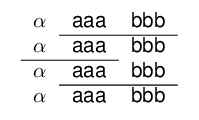

<!-- README.md is generated from README.Rmd. Please edit that file -->

<!--
[](https://travis.metrumrg.com/yoni/texblocks)
--->

# texblocks

## Load Library

``` r
library(texblocks)
library(texPreview)
```

## Initialize basic texblocks

### Single blocks

``` r
x <- as.tb('$\\alpha$')
y <- as.tb('aaa')
z <- as.tb('bbb')
```

### Vectors

``` r
k1 <- lapply(1:3,as.tb)
k2 <- lapply(4:6,as.tb)
```

## Operators

### Horizontal Concatentation

``` r
x1 <- x+y+z
x1
#> $\alpha$&aaa&bbb
```

### Vertical Concatentation

``` r
x/y
#> $\alpha$\\
#> aaa
```

## Creating a tabular object

``` r
x1%>%
  texblocks::tabular()
#> \begin{tabular}{ccc}
#> $\alpha$&aaa&bbb
#> \end{tabular}

x1%>%
  texblocks::tabular(align = 'c|c|c')
#> \begin{tabular}{c|c|c}
#> $\alpha$&aaa&bbb
#> \end{tabular}
```

## Compiling with texPreview

``` r
x1%>%
  texblocks::tabular()%>%
  texPreview::texPreview(stem = "tb1")
```


### Combining blocks

``` r
x1 + x1
#> $\alpha$&aaa&bbb&$\alpha$&aaa&bbb
```

``` r
x2 <- x1 / x1
x2 + x2
#> $\alpha$&aaa&bbb&$\alpha$&aaa&bbb\\
#> $\alpha$&aaa&bbb&$\alpha$&aaa&bbb\\
```

``` r
x2%>%
  texblocks::tabular()%>%
  texPreview::texPreview(stem = "tb2")
```


### Unequal blocks

``` r
x3 <- x2/x2
x2 + x3
#> $\alpha$&aaa&bbb&$\alpha$&aaa&bbb\\
#> $\alpha$&aaa&bbb&$\alpha$&aaa&bbb\\
#> &&&$\alpha$&aaa&bbb\\
#> &&&$\alpha$&aaa&bbb\\
```

``` r
x3%>%
  texblocks::tabular()%>%
  texPreview::texPreview(stem = "tb3")
```


``` r
(x2 / x2)%>%
  texblocks::tabular()%>%
  texPreview::texPreview(stem = "tb4")
```


``` r
(x2 + x3)%>%
  texblocks::tabular()%>%
  texPreview::texPreview(stem = "tb5")
```


``` r
(x3 + x3)%>%
  texblocks::tabular()%>%
  texPreview::texPreview(stem = "tb6")
```


### Reducing vectors

(Not sure if this needs to be wrapped into a single function instead of
having users apply reduce)

``` r
purrr::reduce(k1,`+`)
#> 1&2&3

k <- purrr::reduce(k1,`+`) / purrr::reduce(k2,`+`)

k
#> 1&2&3\\
#> 4&5&6
```

``` r
k %>%
  texblocks::tabular()%>%
  texPreview::texPreview(stem = "tb7")
```


## Converting to a data.frame

``` r
as.data.frame( x2 + x3 )
#> # A tibble: 4 x 6
#>   `1`         `2`   `3`   `4`         `5`   `6`  
#>   <chr>       <chr> <chr> <chr>       <chr> <chr>
#> 1 "$\\alpha$" aaa   bbb   "$\\alpha$" aaa   bbb  
#> 2 "$\\alpha$" aaa   bbb   "$\\alpha$" aaa   bbb  
#> 3 ""          ""    ""    "$\\alpha$" aaa   bbb  
#> 4 ""          ""    ""    "$\\alpha$" aaa   bbb
```

``` r

title <- c('param',sprintf('col%s',1:5))%>%
  purrr::map(as.tb)%>%
  purrr::reduce(`+`)

title / (x2 + x3)%>%
  tabular(align = '|c|ccccc|')%>%
  texPreview::texPreview(stem = "tb8")
```


## hline

add hlines into the table using `tb_hline`

``` r
title / (x2 + x3)%>%
  tb_hline()%>%
  tabular(align = '|c|ccccc|')%>%
  texPreview::texPreview(stem = "tb9")
```


``` r

title / (x2 + x3)%>%
  tb_hline(lines = c(2,3))%>%
  tabular(align = '|c|ccccc|')%>%
  texPreview::texPreview(stem = "tb10")
```


## Multicol/Multirow

``` r
title <- as.tb('param') + multicol('vals',3,'c|')

tab <- title / (multirow('$\\beta$',2) + k)

tab%>%
  tabular(align = '|cccc|')%>%
  texPreview::texPreview(stem='tb11')
```



# Design/Specs

Building blocks for TeX tables

## Idea

Assemble LaTeX tabular environments using simple operations.

This would enable us to create any table layout with a consistent user
API.

Defining a new class of R element `tabular` that is the basic structure
of the language.

## Proposed Syntax

Defining a new class of R element `tb` that is the basic structure of
the language.

### Joining elements

Let `t1` and `t2` be two objects of class tb.

|           |     |
| :-------: | :-: |
| `t1 + t2` | ⬛ ⬛ |

|           |   |
| :-------: | :-: |
|           | ⬛ |
| `t1 / t2` |   |
|           | ⬛ |

Using this language creating a table can be broken down to cell level

`t1 =(`⬛`+`⬛`+`⬛`) / (`⬛`+`⬛`+`⬛`)`

would be translated to

    1 & 2 & 3 \\
    4 & 5 & 6

making their combination a natural extension

`t1 + t1`

would translate to

    1 & 2 & 3 & 1 & 2 & 3 \\
    4 & 5 & 6 & 1 & 2 & 3

### Mutations

  - multirow
  - multicolumn

### Aesthetics

A set of aesthetic elements can be defined to control the table and cell
level attributes, eg

  - font: colour, size, face
  - background colour
  - grid: hline, cline
