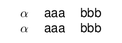
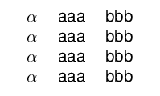
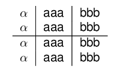
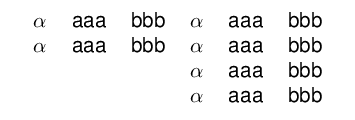
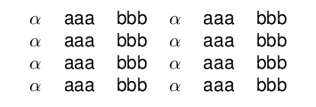
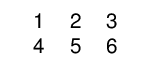
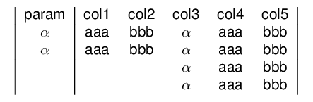

<!-- README.md is generated from README.Rmd. Please edit that file -->
[](https://travis.metrumrg.com/yoni/texblocks)

# Load Library

``` r
library(texblocks)
library(texPreview)
```

# Initialize basic texblocks

## Single blocks

``` r
x <- as.tb('$\\alpha$')
y <- as.tb('aaa')
z <- as.tb('bbb')
```

## Vectors

``` r
k1 <- lapply(1:3,as.tb)
k2 <- lapply(4:6,as.tb)
```

# Operators

## Horizontal Concatentation

``` r
x1 <- x+y+z
x1
#> $\alpha$&aaa&bbb
```

## Vertical Concatentation

``` r
x/y
#> $\alpha$\\
#> aaa
x-y
#> $\alpha$\\ \hline
#> aaa
```

# Creating a tabular object

``` r
texblocks::tabular( x1 ,align = 'c|c|c')
#> \begin{tabular}{c|c|c}
#> $\alpha$&aaa&bbb
#> \end{tabular}
```

# Compiling with texPreview

``` r
texPreview::texPreview(tabular(x1 ,'c|c|c'),stem = "tb1")
```


## Combining blocks

``` r
x1 + x1
#> $\alpha$&aaa&bbb&$\alpha$&aaa&bbb
```

``` r
x2 <- x1 / x1
x2 + x2
#> $\alpha$&aaa&bbb&$\alpha$&aaa&bbb\\
#> $\alpha$&aaa&bbb&$\alpha$&aaa&bbb
```

``` r
texPreview::texPreview(tabular(x2 ,'c|c|c'),stem = "tb2")
```



## Unequal blocks

``` r
x3 <- x2/x2
x2 + x3
#> $\alpha$&aaa&bbb&$\alpha$&aaa&bbb\\
#> $\alpha$&aaa&bbb&$\alpha$&aaa&bbb\\
#> &&&$\alpha$&aaa&bbb\\
#> &&&$\alpha$&aaa&bbb
```

``` r
texPreview::texPreview(tabular(x3 ,'c|c|c'),stem = "tb3")
```



``` r
texPreview::texPreview(tabular(x2-x2 ,'c|c|c'),stem = "tb4")
```



``` r
texPreview::texPreview(tabular(x2 + x3 ,'c|c|c|c|c|c'),stem = "tb5")
```



``` r
texPreview::texPreview(tabular(x3 + x3,'c|c|c|c|c|c'),stem = "tb6")
```



## Reducing vectors

``` r
k <- purrr::reduce(k1,`+`) / purrr::reduce(k2,`+`)
k
#> 1&2&3\\
#> 4&5&6
```

``` r
texPreview::texPreview(tabular(k,'ccc'),stem = "tb7")
```



# Converting to a data.frame

``` r
as.data.frame( x2 + x3 )
#> # A tibble: 4 x 7
#>   `1`         `2`   `3`   `4`         `5`   `6`       r
#>   <chr>       <chr> <chr> <chr>       <chr> <chr> <int>
#> 1 "$\\alpha$" aaa   bbb   "$\\alpha$" aaa   bbb       1
#> 2 "$\\alpha$" aaa   bbb   "$\\alpha$" aaa   bbb       2
#> 3 ""          ""    ""    "$\\alpha$" aaa   bbb       3
#> 4 ""          ""    ""    "$\\alpha$" aaa   bbb       4
```

``` r

title <- c('param',sprintf('col%s',1:5))%>%
  purrr::map(as.tb)%>%
  purrr::reduce(`+`)

texPreview::texPreview(tabular(title-(x2+x3) ,'|c|ccccc|'),stem = "tb8")
```


