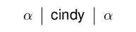
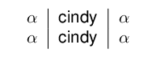
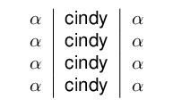
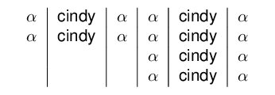
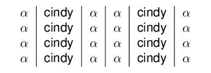
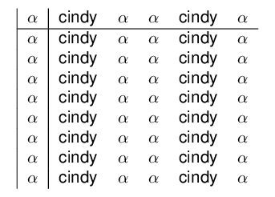

```r
library(texblocks)
library(texPreview)
```
 


```r
x <- '$\\alpha$'
y <- 'cindy'
class(x) <- 'tb'
class(y) <- 'tb'
```
 

```r
x1 <- x+y+x
x1
#> $\alpha$&cindy&$\alpha$
```
 

```r
x1 + x1
#> $\alpha$&cindy&$\alpha$&$\alpha$&cindy&$\alpha$
x1 / x1
#> $\alpha$&cindy&$\alpha$\\
#> $\alpha$&cindy&$\alpha$
x1 - x1
#> $\alpha$&cindy&$\alpha$\\ \hline
#> $\alpha$&cindy&$\alpha$
```
 

```r
x2 <- x1 / x1
x2 + x2
#> $\alpha$&cindy&$\alpha$&$\alpha$&cindy&$\alpha$\\
#> $\alpha$&cindy&$\alpha$&$\alpha$&cindy&$\alpha$
```
 

```r
x3 <- x2/x2
x2 + x3
#> $\alpha$&cindy&$\alpha$&$\alpha$&cindy&$\alpha$\\
#> $\alpha$&cindy&$\alpha$&$\alpha$&cindy&$\alpha$\\
#> &&&$\alpha$&cindy&$\alpha$\\
#> &&&$\alpha$&cindy&$\alpha$
```


```r
as.data.frame( x2 + x3 )
#> # A tibble: 4 x 7
#>   `1`         `2`   `3`         `4`         `5`   `6`             r
#>   <chr>       <chr> <chr>       <chr>       <chr> <chr>       <int>
#> 1 "$\\alpha$" cindy "$\\alpha$" "$\\alpha$" cindy "$\\alpha$"     1
#> 2 "$\\alpha$" cindy "$\\alpha$" "$\\alpha$" cindy "$\\alpha$"     2
#> 3 ""          ""    ""          "$\\alpha$" cindy "$\\alpha$"     3
#> 4 ""          ""    ""          "$\\alpha$" cindy "$\\alpha$"     4
```


```r
texblocks::tabular( x2 + x3,align = 'c|c|c|c|c|c')
#> \begin{tabular}{c|c|c|c|c|c}
#> $\alpha$&cindy&$\alpha$&$\alpha$&cindy&$\alpha$\\
#> $\alpha$&cindy&$\alpha$&$\alpha$&cindy&$\alpha$\\
#> &&&$\alpha$&cindy&$\alpha$\\
#> &&&$\alpha$&cindy&$\alpha$
#> \end{tabular}
```

# Compiled


```r
texPreview::texPreview(tabular(x1 ,'c|c|c'),stem = "tb1")
```


 

```r
texPreview::texPreview(tabular(x2 ,'c|c|c'),stem = "tb2")
```


 

```r
texPreview::texPreview(tabular(x3 ,'c|c|c'),stem = "tb3")
```


 

```r
texPreview::texPreview(tabular(x2-x2 ,'c|c|c'),stem = "tb4")
```


 

```r
texPreview::texPreview(tabular(x2 + x3 ,'c|c|c|c|c|c'),stem = "tb5")
```


 

```r
texPreview::texPreview(tabular(x3 + x3,'c|c|c|c|c|c'),stem = "tb6")
```


 

```r
texPreview::texPreview(tabular((x1+x1)-(x3 + x3)/(x3 + x3) ,'|c|ccccc'),stem = "tb7")
```


